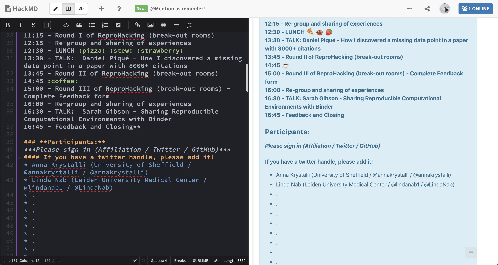
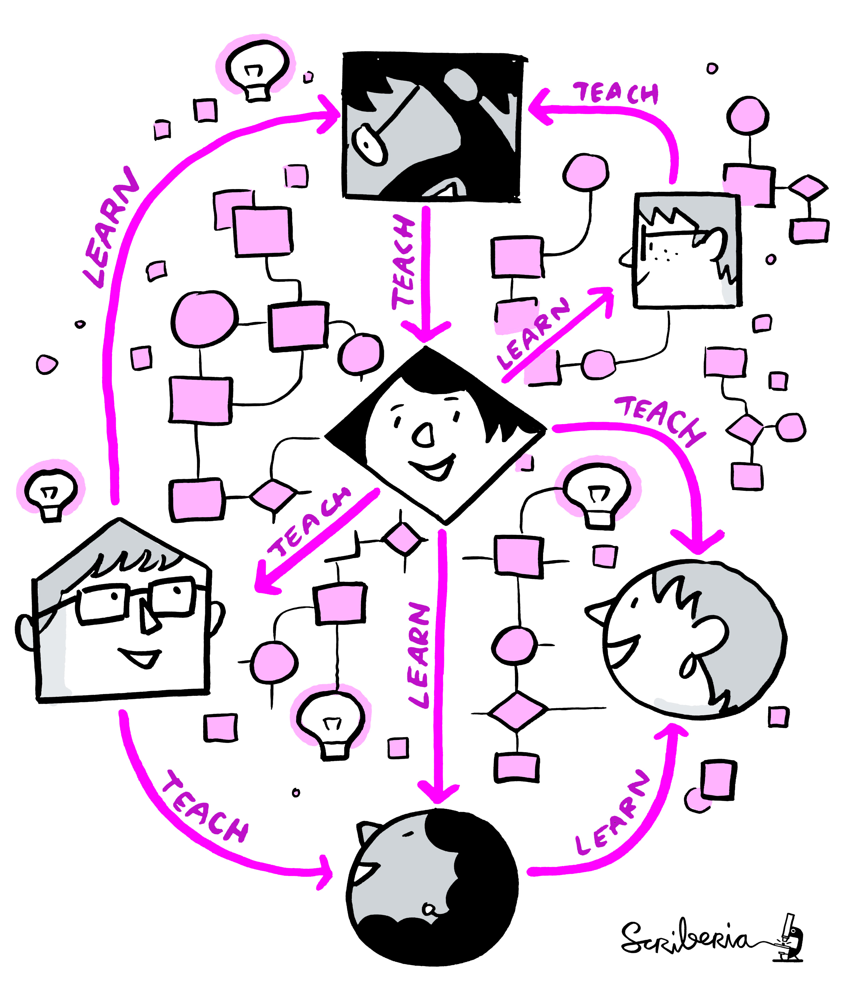

class: inverse


```{r xaringan-themer, include = FALSE}
library(xaringanthemer)

style_duo_accent(primary_color = "#2D896B", secondary_color = "#02CC98",
                  base_font_size = "18px",
  header_font_google = google_font("Poppins", "500"),
  text_font_google   = google_font("Work Sans", "400", "400i"),
  code_font_google   = google_font("Source Code Pro"),
  title_slide_text_color = "white",
  background_color = "white",
  black_color = "#2a332c",
  title_slide_background_image = "../background.jpg",
  outfile = "assets/css/reprohack-themer.css"
)
```


## Welcome to the 1st ReproHack Hub Launch!

<!-- Put the link to this slide here so people can follow -->

<br>

### `r emo::ji("wave")` from the organising team

#### _David Quigley & Anna Krystalli_

***

### Event Page: [bit.ly/hpc-reprohack-hub](https://bit.ly/hpc-reprohack)

Contains all event information and links to materials

### `r icons::fontawesome("twitter")` #ReproHackHub @ReproHack


???

Welcome everyone on behalf of the whole ReproHack team!

So, not all of us could sadly be here today, but you have got myself, as well as Linda Nab, who'm you'll hear a bit more from shortly.

I hope you've signed into the hackpad which has a lot of information, as does our event page. Both links should be in the chat.

Which brings us to why we are all here today.

So yes, we will be ReproHacking, so **working with code and data to try and reproduce** submitted papers.

---

> # Reprohack:
> #### Sandbox Environment for Practicing Research Reproducibility

--

> one day events using participants' laptops


<br>

Traditional format **excludes the examination of the reproducibility of computationally intensive research!**

--

# Enter the 1st HPC ReproHack


 
???

But what's what really special about today's event is that, for the first time, we'll be using our purpose built ReproHack Hub.

Right from the start of the project, we'd get requests from people that wanted to run their own events and we had tried really hard to create templates and make the infrastructure we used reproducible. 

But it was still complicated, a lot of moving parts, held together with a lot duck tape. We always wanted a centralised hub that provided all the required infrastructure so that event organisers (including ourselves) but also authors submitting papers or participants submitting reviews, would find it easy to do what they needed to do and focus on the experience itself.

It took a lot longer than we hoped but we are really so excited to share with you what we've created. 


---
class: center, middle

# Thank you! 

## EPSRC for funding


```{r, echo=FALSE, out.width="30%"}

```


## Sulis for Compute Power

#### _and **David Quigley** for securing the funding_


???

I want to take the opportunity upfront to thank the N8 CIR, 

they've been firm supporters from early on, sponsored a number of previous events and also provided funding for developer time that got the hub off the ground so we really couldn't have  gotten here without their support.

---
class: inverse, center, middle

# Agenda

???

OK I'll do a quick blast through the agenda,

---

# HPC ReproHack Launch 

### 21st March


| Time 	| Event 	|
|---	|---	|
| 10:00 - 10:15 	| **Anna Krystalli:** Welcome, Introduction to event. 	|
| 10:15 - 10:40 	| **Martin Callaghan:** HPC in the age of Data Science 	|
| 10:40 - 11:30 	| **Twin Karmakharm:** Reproducibility on HPC 	|
| 11:30 - 11:45 	| COFFEE 	|
| 11:45 - 12:10 	| **Heather Ratcliffe:** Introduction to Sulis 	|
| 12:10 - 12:35 	| **Mike Croucher:** Reproducible MATLAB on HPC 	|
| 12:35 - 12:55 	| **Mozhgan Kabiri Chimeh:** NVIDIA AI & HPC Containers 	|
| 13:00 - 14:00 	| LUNCH 	|
| 14:00 - 14:20 	| **Anna Krystalli:** Introduction to ReproHacking 	|
| 14:20 - 17:00 	| Initial ReproHack Session 	|


---

# HPC ReproHack 

### Drop in sessions

| Date 	| Time 	| Event 	|
|---	|---	|---	|
| 22nd March 	| 14:00 - 16:00 	| Drop In support session 	|
| 24th March 	| 14:00 - 16:00	| Drop In support session 	|
| 28th March 	| 14:00 - 16:00 	| Drop In support session 	|
| 30th March 	| 14:00 - 16:00 	| Drop In support session 	|

---

# HPC ReproHack 

### Closing sessions

| Date 	| Time 	| Event 	|
|---	|---	|---	|
| 31st March 	| 10:00 - 13:00 	| Closing Event 	|


???


In te afternoon, remember to take a coffee break and also submit your reviews by the end of the day.

At 4pm, we'll rejoin to hear from Stephen Eglen on the Code Check project.

We'll close by sharing our final thoughts about the experience followed by some closing remarks.

---
class: inverse

# House Keeping:


???

So some quick housekeeping


---

## ReproHack hackpad `r emo::ji("right_arrow")`   [hackmd.io](https://hackmd.io/s/features) notepad


```{r, echo=FALSE, out.width="90%"}

```


???

As I've mentioned, we're also using a hackpad, specifically a hackmd hackpad. So this pad understands markdown, which is the text shown on the left and it is rendered on the right. If you are not familiar with markdown, don't worry too much, just use it as a plain text editor or you can have a quick look at hack md documentation, there's a link at the top of the hackpad.

---
class: inverse


# Ice breaker:  Introductions

<!-- Use this section as an ice-breaker. Introduce yourself, then allow others to 
go around the room and introduce themselves too -->

???

Now we're going to do a quick round of intriductions, and I'll put you in smaller break out groups and there's three questions Id like you to answer.

I'll go first:
---

<!-- Add details about yourself the organiser here: -->

## Who am I?

> ### Dr Anna Krystalli (@annakrystalli)
> 
> - Research Software Engineer _University of Sheffield_
>
> - 2019 Fellow _Software Sustainability Institute_
>
> - Software Peer Review Editor _rOpenSci_ 
>
> - Core Team Member _ReproHack_

---

## Why am I here?

> I believe there's lots to learn about Reproducibility from working with other people's materials and engaging with real published research code and data.


???

- I feel very strongly that working with these resources is a really powerful working experience. But also that if we don't engage with the materials, we (the authors who have put all this effort in included) won't really know if they are actually reproducible and therefore fit for purpose.
---

## Who is my favorite animated character?

> Stitch!
>
> 

???

I think he's cute and my friends think that's who I turn into after I've had a couple of strong ciders!

---

<!-- Open it up to participants -->
# Your turn

### in small groups (5 mins)

> - ### Who are you?

> - ### Why are you here?

> - ### Who is your favorite animated character?

???

OK, so it's your turn now, I'm going to put you into break out groups where you'll have 5 minutes to answer these 3 questions amongst yourself.

---
class: inverse

## Welcome back!

***

# Talks

---
class: inverse

## `r emo::ji("loudspeaker")` Martin Callaghan  

#### _Research Computing Consultant and part of the Research Computing group at the University of Leeds_

<br>

> ### *"HPC in the age of Data Science"*


---
class: talk, middle


## `r emo::ji("loudspeaker")` Twin Karmakharm
### _Research Software Engineer, University of Sheffield._

<br>

> # *"Reproducibility on HPC"*

---
class: center, middle, bottom
background-image: url("../assets/coffee-break-cast.jpeg")
background-size: cover


# COFFEE BREAK

## 11:30 - 11:45


---
class: talk, middle


## `r emo::ji("loudspeaker")` Heather Ratcliffe
### _Research Software Engineer, University of Warwick_

<br>

> # *"Introduction to Sulis"*

---
class: talk, middle


## `r emo::ji("loudspeaker")` Mike Croucher
### _Principal Customer Success Engineer, MathWorks_

<br>

> # *"Reproducible MATLAB on HPC"*

---
class: talk, middle


## `r emo::ji("loudspeaker")` Mozhgan Kabiri Chimeh
### _GPU Developer Advocate, NVIDIA_

<br>

> # *"NVIDIA AI & HPC Containers"*

---
class: center, middle
background-image: url("../assets/lunch-break.jpeg")
background-size: cover

# LUNCH

## 13:00 - 14:00

---
class: inverse

## Welcome back!

***

# Tips for Reproducing & Reviewing

---

## ReproHack Objectives

1. **Reproduce a paper from associated code and data**

3. **Feedback experiences to Authors**

5. **Think more broadly about opportunities and challenges**

<br>


--

### + **Explore Reproducibility of Computationally Intensive research**

> #### All papers to be reproduced on the **Sulis High Performance Computing Platform!** 

---


.pull-left[

## Code of Conduct

Event governed by **ReproHack Code of Conduct** 

<https://reprohack.org/code-of-conduct>

```{r, echo=FALSE}

```

]


--
.pull-right[
### Additional Considerations

- #### Reproducibility is hard!
- #### Submitting authors are incredibly brave!

### Thank you Authors! `r emo::ji("raised_hands")` 

- #### Without them there would be no ReproHack.
- #### Show gratitude and appreciation for their efforts. `r emo::ji("pray")` 
- #### Constructive criticism only please!

]
---
class: inverse, center, middle

# `r emo::ji("mag")` Reproducing & Reviewing


```{r, echo=FALSE, out.width="70%"}
knitr::include_graphics("assets/Hackathon.jpg")
```

---
class: middle


.pull-left[

## Selecting Papers


### [reprohack.org/event/14](https://reprohack.org/event/14)

- **Information submitted by authors:**

  - Languages / tools used (tags)
  
  - Why you should attempt the paper.
  

    
- Register paper using template in hackpad.

- Create account on Sulis

]


.pull-right[


```{r, echo=FALSE}

```


]


---
class: inverse, center, middle

# Review as an auditor `r emo::ji("bookmark_tabs")`


--

#### **tl;dr: Don't be this guy!**

```{r, echo=FALSE, out.width="60%"}
knitr::include_graphics("https://www.reactiongifs.com/r/O_o.gif")
```


---
class:centers

# `r emo::ji("mag")` For FAIR materials

```{r, echo=FALSE, out.width="80%"}
knitr::include_graphics("assets/FAIRPrinciples.jpg")
```

---

.pull-left[

# Access

- How **easy** was it to **gain** access to the materials?

- Did you manage to download all the files you needed?

]

--

.pull-right[

# Installation

- How **easy / automated** was **installation**?

- Did you have any problems?

- How did you solve them?
]

--- 
---

.pull-left[


# Data

- Were **data clearly separated from code and other items**?

- Were **large data files deposited in a trustworthy data repository** and referred to using a **persistent identifier**?

- Were **data documented** ...somehow...

]

--

.pull-right[

# Documentation

Was there **adequate documentation** describing:
- how to **install** necessary software including non-standard dependencies?

- how to **use** materials to reproduce the paper?

- how to **cite** the materials, ideally in a form that can be copy and pasted?

]
---

.pull-left[

# Analysis

- **Were you able to fully reproduce** the paper? `r emo::ji("white_check_mark")`

- **How automated** was the process of reproducing the paper?

- **How easy was it to link** analysis **code** to:
   - the **plots** it generates
   - **sections in the manuscript** in which it is described and results reported
]
--

.pull-right[

<br>

### If the analysis was not fully reproducible `r emo::ji("no_entry_sign")`
 - Were there **missing dependencies?**
 
 - Was the **computational environment not adequately described** / captured?
 
 - Was there **bugs** in the code?
 
 - Did **code run but results (e.g. model outputs, tables, figures) differ** to those published? By **how much?**
]

---
class: inverse, center, middle

# Review as a user `r emo::ji("video_game")`

--

.pull-left[

### New User

```{r, echo=FALSE, out.width="80%"}
knitr::include_graphics("https://25.media.tumblr.com/30906cccedfe97a3d5450a23359ca298/tumblr_ml72i2eL6t1rsudnqo1_500.gif")
```


]

--

.pull-right[

### Invested User

```{r, echo=FALSE, out.width="80%"}
knitr::include_graphics("https://media.giphy.com/media/9K2nFglCAQClO/source.gif")
```


]


---
## Review as a user `r emo::ji("video_game")`

<br>

#### What did you find easy / intuitive?
> Was the file structure and file naming informative / intuitive?
> Was the analysis workflow easy to follow? 
> Was there missing / confusing documentation?


#### What did you find confusing / difficult
> Identify pressure points. Constructive suggestions?


#### What did you enjoy?
> Identify aspects that worked well.

---
class: inverse, center, middle

# Feed back

# `r emo::ji("speech_balloon")`

---


## Feedback as a community member

.pull-left[

#### Acknowledge author effort

#### Give feedback in good faith

#### Focus on community benefits and system level solutions


```{r, echo=FALSE, out.width="80%"}
knitr::include_graphics("assets/1728_TURI_Book sprint_11 community_040619.jpg")
```

]
.pull-right[

> #### _Help build convention on what a Research Compendium should be and how we should be able to use it_

```{r, echo=FALSE, out.width="80%"}
knitr::include_graphics("assets/ResearchCompendium.jpg")
```


]
---
# Submit review

1. ### Sign up / Log in

2. ### New Review: [reprohack.org/review/new](https://www.reprohack.org/review/new)
  
  ```{r, echo=FALSE, out.width="70%"}
  
  knitr::include_graphics("assets/new-review.png")
  ```


---
class: inverse, center, middle

# Participant Guidelines

### [reprohack.org/participant_guidelines](https://www.reprohack.org/participant_guidelines)


---


### Participation guidelines

#### During launch day
- You have the rest of the afternoon to begin ReproHacking with help from organisers and mentors.
- It is recommended you familiarise yourself with the feedback form early on.

#### During Drop in support sessions
- We have four scheduled drop in sessions (see agenda for details)
- RSE and HPC support will be available at these times

#### At any time
- Schedule time with your team to work on your project.
- Contact and schedule support meetings with your mentors.
- Feel free to add to the collaborative notes on the hackpad.

#### Closing event

- Each group will be expected to give a short presentation (5-10 mins) summarising their experiences and lessons learnt. Feel free to create slides if you wish.
- Make sure you have completed your feedback form as a team.


---
class: center, middle
background-image: url("../assets/question.jpeg")
background-size: cover

# Questions?

---
class: inverse

# Let's go! `r emo::ji("checkered_flag")`

## Now - 16:30

### `r emo::ji("mag_right")` Paper List review

+ Have a look at the [papers available for reproduction](https://reprohack.org/event/14)


### `r emo::ji("busts_in_silhouette")` Team formation / project registration

+ Fine to work individually
+ Add your details to the [**hackpad: bit.ly/hpc-reprohack-hackpad**](https://bit.ly/hpc-reprohack-hackpad).
+ Register your team and paper on the [**hackpad: bit.ly/hpc-reprohack-hackpad**](https://bit.ly/hpc-reprohack-hackpad)

### Mentors will be assigned once papers selected


---
class: inverse, middle

# First day re-group `r emo::ji("thought_balloon")`

> ### Summarise group experiences
> - What approaches to reproducibility the papers taken.
> - Anything in particular you like about the approaches so far?
> - Anything you're having difficulty with?


---
# Carry on ReproHacking!

#### Join a Drop in Session if you need help.

#### Coordinate with your mentors for additional support.

#### Use ReproHack slack for communication:


[](https://reprohack-autoinvite.herokuapp.com/) `#warwick-hpc-reprohack`

#### Complete a feedback form for the authors


### Regroup on the 31st March

---
class: center, middle
background-image: url("../assets/question.jpeg")
background-size: cover

# Questions?

---
class: middle

# THANK YOU ALL! `r emo::ji("pray")`

### See you on the 31st March 10:00 - 13:00


# `r emo::ji("wave")`

---

# Acknowledgements

Images throughout the slides watermarked with **Scriberia** were created by [Scriberia](https://www.scriberia.co.uk/) for The Turing Way community and is used under a CC-BY licence 
- _The Turing Way Community, & Scriberia. (2019, July 11). Illustrations from the Turing Way book dashes. Zenodo. http://doi.org/10.5281/zenodo.3332808_

- Coffee Break Photo by <a href="https://unsplash.com/@mindspacestudio?utm_source=unsplash&utm_medium=referral&utm_content=creditCopyText">Mindspace Studio</a> on <a href="https://unsplash.com/s/photos/coffee-break?utm_source=unsplash&utm_medium=referral&utm_content=creditCopyText">Unsplash</a>

- Lunch Break Photo by <a href="https://unsplash.com/@ferhadd?utm_source=unsplash&utm_medium=referral&utm_content=creditCopyText">Farhad Ibrahimzade</a> on <a href="https://unsplash.com/s/photos/lunch-break?utm_source=unsplash&utm_medium=referral&utm_content=creditCopyText">Unsplash</a>

- Question mark Photo by <a href="https://unsplash.com/@towfiqu999999?utm_source=unsplash&utm_medium=referral&utm_content=creditCopyText">Towfiqu barbhuiya</a> on <a href="https://unsplash.com/s/photos/questions?utm_source=unsplash&utm_medium=referral&utm_content=creditCopyText">Unsplash</a>
  
  
  
