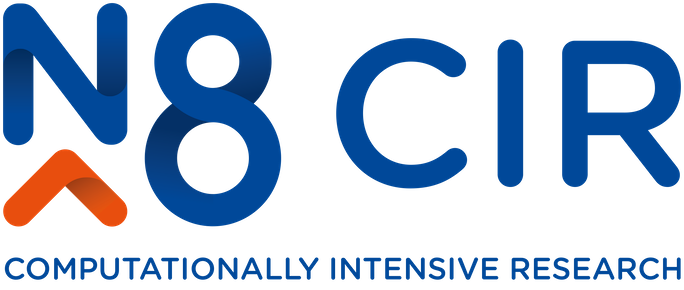

class: inverse


```{r xaringan-themer, include = FALSE}
library(xaringanthemer)

style_duo_accent(primary_color = "#2D896B", secondary_color = "#46CC97",
                  base_font_size = "18px",
  header_font_google = google_font("Poppins", "500"),
  text_font_google   = google_font("Work Sans", "400", "400i"),
  code_font_google   = google_font("Source Code Pro"),
  title_slide_text_color = "white",
  background_color = "white",
  black_color = "#2a332c",
  title_slide_background_image = "../background.jpg",
  outfile = "assets/css/reprohack-themer.css"
)
```


## Welcome to the ReproHack Hub Launch!

<!-- Put the link to this slide here so people can follow -->


### `r emo::ji("wave")` from the whole ReproHack team

#### _Anna, Daniela, Florencia, Linda, Ricci_

***

### Event Page: [bit.ly/reprohack-hub-launch](https://bit.ly/reprohack-hub-launch)

Contains all event information and links to materials

### `r icons::fontawesome("twitter")` #ReproHackHub @ReproHack


???

Welcome everyone on behalf of the whole ReproHack team!

So, not all of us could sadly be here today, but you have got myself, as well as Linda Nab, who'm you'll hear a bit more from shortly.

I hope you've signed into the hackpad which has a lot of information, as does our event page. Both links should be in the chat.

Which brings us to why we are all here today.

So yes, we will be ReproHacking, so **working with code and data to try and reproduce** submitted papers.

---
background-image: url("assets/reprohack-hub-screenshot.png")
background-size: contain

???

But what's what really special about today's event is that, for the first time, we'll be using our purpose built ReproHack Hub.

Right from the start of the project, we'd get requests from people that wanted to run their own events and we had tried really hard to create templates and make the infrastructure we used reproducible. 

But it was still complicated, a lot of moving parts, held together with a lot duck tape. We always wanted a centralised hub that provided all the required infrastructure so that event organisers (including ourselves) but also authors submitting papers or participants submitting reviews, would find it easy to do what they needed to do and focus on the experience itself.

It took a lot longer than we hoped but we are really so excited to share with you what we've created. 


---
class: center, middle

# Thank you N8 CIR

_N8 Centre of Excellence in Computationally Intensive Research_

### <https://n8cir.org.uk/>

```{r, echo=FALSE, out.width="50%"}

```


???

I want to take the opportunity upfront to thank the N8 CIR, 

they've been firm supporters from early on, sponsored a number of previous events and also provided funding for developer time that got the hub off the ground so we really couldn't have  gotten here without their support.

---
class: inverse, center, middle

# Agenda

???

OK I'll do a quick blast through the agenda,

---

### Morning

**10:00 Welcome**
- **Intro to Blackboard Collaborate**
- Ice breaker (split into rooms)

**10:20 `r emo::ji("loudspeaker")` Dr. Esther Plomp** ***The Turing Way Community*** 

**10:45 Introduction & tips for reviewing**


***11:10 Reprohack Round I***
- **Review list, form groups, select papers (break-out rooms)**
- **COFFEE BREAK** 
- Work on papers 

???


This morning, after some housekeeping and an Ice breaker, we'll be hearing from Dr. Esther Plomp about the Turing Way Community.

I'll follow on with some tips and tricks for reproducing and then we'll dive straight in and start exploring, selecting and then beginning work on our papers.


---

### Lunchtime

**12:30 Regroup: get someone from each group to tell us a bit about their experiences.**

**12:45 LUNCH BREAK**

***13:45 Reprohack Round II***
- Work on papers (break-out rooms)

???

We'll regroup before lunch to share how we're getting on and then break for an hour at 12:45

After lunch we carry on ReproHacking

---

### Afternoon
***Reprohack Round III***

- Work on papers (break-out rooms)
- 14:45 COFFEE BREAK `r emo::ji("house")` `r emo::ji("coffee")`
- Work on papers - **Complete feedback form**

**16:00 `r emo::ji("loudspeaker")` Prof. Stephen Eglen -** ***Sharing Reproducible Computational Environments with Binder***

**16:25 Regroup - get someone from each group to tell us a bit about their experiences.**


**16:50 Closing**

???

In te afternoon, remember to take a coffee break and also submit your reviews by the end of the day.

At 4pm, we'll rejoin to hear from Stephen Eglen on the Code Check project.

We'll close by sharing our final thoughts about the experience followed by some closing remarks.

---
class: inverse

# House Keeping:


???

So some quick housekeeping

***

## Tour of Blackboard Collaborate

> ### Linda Nab


???

I'll hand over to Linda who will give you a quick tour of blackboard collaborate.

---

## ReproHack hackpad `r emo::ji("right_arrow")`   [hackmd.io](https://hackmd.io/s/features) notepad


```{r, echo=FALSE, out.width="90%"}
knitr::include_graphics("assets/hackmd.png")
```


???

As I've mentioned, we're also using a hackpad, specifically a hackmd hackpad. So this pad understands markdown, which is the text shown on the left and it is rendered on the right. If you are not familiar with markdown, don't worry too much, just use it as a plain text editor or you can have a quick look at hack md documentation, there's a link at the top of the hackpad.

---
class: inverse


# Ice breaker:  Introductions

<!-- Use this section as an ice-breaker. Introduce yourself, then allow others to 
go around the room and introduce themselves too -->

???

Now we're going to do a quick round of intriductions, and I'll put you in smaller break out groups and there's three questions Id like you to answer.

I'll go first:
---

<!-- Add details about yourself the organiser here: -->

## Who am I?

> ### Dr Anna Krystalli (@annakrystalli)
> 
> - Research Software Engineer _University of Sheffield_
>
> - 2019 Fellow _Software Sustainability Institute_
>
> - Software Peer Review Editor _rOpenSci_ 
>
> - Core Team Member _ReproHack_

---

## Why am I here?

> I believe there's lots to learn about Reproducibility from working with other people's materials and engaging with real published research code and data.


???

- I feel very strongly that working with these resources is a really powerful working experience. But also that if we don't engage with the materials, we (the authors who have put all this effort in included) won't really know if they are actually reproducible and therefore fit for purpose.
---

## Who is my favorite animated character?

> Stitch!
>
> 

???

I think he's cute and my friends think that's who I turn into after I've had a couple of strong ciders!

---
class: inverse

# Let's hear from the ReproHack Team!

---

<!-- Open it up to participants -->
# Your turn

### in break-out rooms (5 mins)

> - ### Who are you?

> - ### Why are you here?

> - ### Who is your favorite animated character?

???

OK, so it's your turn now, I'm going to put you into break out groups where you'll have 5 minutes to answer these 3 questions amongst yourself.

--

### As a group

> ### Name your room! `r emo::ji("snow-capped mountain")``r emo::ji("camping")``r emo::ji("desert")``r emo::ji("roller_coaster")``r emo::ji("national_park")``r emo::ji("stadium")``r emo::ji("castle")``r emo::ji("Tokyo_tower")``r emo::ji("sunrise")``r emo::ji("desert_island")`

???

As I group, for a bit of fun, also decide on a name for the room your group and record it in the hackpad. When we come back Linda will rename them for you.

Please be back in 5 mins sharp for our first talk.


---
class: inverse

## `r emo::ji("loudspeaker")` Dr. Esther Plomp
#### _Data Steward of the Faculty of Applied Sciences at TU Delft, Netherlands. _

<br>

> ### *"The Turing Way Community"*

---
class: inverse

## Welcome back!

***

# Tips for Reproducing & Reviewing

---

## ReproHack Objectives

1. **Practical Experience in Reproducibility**

3. **Feedback to Authors**

5. **Think more broadly about opportunities and challenges**


---


.pull-left[

## Code of Conduct

Event governed by **ReproHack Code of Conduct** 

<https://reprohack.org/code-of-conduct>

```{r, echo=FALSE}
knitr::include_graphics("assets/1728_TURI_Book sprint_7 community_040619.jpg")
```

]


--
.pull-right[
### Additional Considerations

- #### Reproducibility is hard!
- #### Submitting authors are incredibly brave!

### Thank you Authors! `r emo::ji("raised_hands")` 

- #### Without them there would be no ReproHack.
- #### Show gratitude and appreciation for their efforts. `r emo::ji("pray")` 
- #### Constructive criticism only please!

]
---
class: inverse, center, middle

# `r emo::ji("mag")` Reproducing & Reviewing


```{r, echo=FALSE, out.width="70%"}
knitr::include_graphics("assets/Hackathon.jpg")
```

---

## Selecting Papers

.pull-left[
- **Information submitted by authors:**

  - Languages / tools used (tags)
  
  - Why you should attempt the paper.
  
- **No. attempts `r icons::fontawesome('recycle')`** No. times reproduction has been attempted

- **Mean Repro Score `r icons::fontawesome('check-circle')`** Mean reproducibility score (out of 10)

    - lower == harder!
    
- Register paper using template in hackpad:
    ```
    ### **Paper:** <Title of the paper reproduced>
    **Reviewers:** Reviewer 1, Reviewer 2 etc.
    ```
]


.pull-right[
```{r, echo=FALSE}
knitr::include_graphics("assets/browse-paper-list.png")
```

### [reprohack.org/paper/](https://reprohack.org/paper/)

]


---
class: inverse, center, middle

# Review as an auditor `r emo::ji("bookmark_tabs")`


--

#### **tl;dr: Don't be this guy!**

```{r, echo=FALSE, out.width="60%"}
knitr::include_graphics("https://www.reactiongifs.com/r/O_o.gif")
```


---
class:centers

# `r emo::ji("mag")` For FAIR materials

```{r, echo=FALSE, out.width="80%"}
knitr::include_graphics("assets/FAIRPrinciples.jpg")
```

---

.pull-left[

# Access

- How **easy** was it to **gain** access to the materials?

- Did you manage to download all the files you needed?

]

--

.pull-right[

# Installation

- How **easy / automated** was **installation**?

- Did you have any problems?

- How did you solve them?
]

--- 
---

.pull-left[


# Data

- Were **data clearly separated from code and other items**?

- Were **large data files deposited in a trustworthy data repository** and referred to using a **persistent identifier**?

- Were **data documented** ...somehow...

]

--

.pull-right[

# Documentation

Was there **adequate documentation** describing:
- how to **install** necessary software including non-standard dependencies?

- how to **use** materials to reproduce the paper?

- how to **cite** the materials, ideally in a form that can be copy and pasted?

]
---

.pull-left[

# Analysis

- **Were you able to fully reproduce** the paper? `r emo::ji("white_check_mark")`

- **How automated** was the process of reproducing the paper?

- **How easy was it to link** analysis **code** to:
   - the **plots** it generates
   - **sections in the manuscript** in which it is described and results reported
]
--

.pull-right[

<br>

### If the analysis was not fully reproducible `r emo::ji("no_entry_sign")`
 - Were there **missing dependencies?**
 
 - Was the **computational environment not adequately described** / captured?
 
 - Was there **bugs** in the code?
 
 - Did **code run but results (e.g. model outputs, tables, figures) differ** to those published? By **how much?**
]

---
class: inverse, center, middle

# Review as a user `r emo::ji("video_game")`

--

.pull-left[

### New User

```{r, echo=FALSE, out.width="80%"}
knitr::include_graphics("https://25.media.tumblr.com/30906cccedfe97a3d5450a23359ca298/tumblr_ml72i2eL6t1rsudnqo1_500.gif")
```


]

--

.pull-right[

### Invested User

```{r, echo=FALSE, out.width="80%"}
knitr::include_graphics("https://media.giphy.com/media/9K2nFglCAQClO/source.gif")
```


]


---
## Review as a user `r emo::ji("video_game")`

<br>

#### What did you find easy / intuitive?
> Was the file structure and file naming informative / intuitive?
> Was the analysis workflow easy to follow? 
> Was there missing / confusing documentation?


#### What did you find confusing / difficult
> Identify pressure points. Constructive suggestions?


#### What did you enjoy?
> Identify aspects that worked well.

---
class: inverse, center, middle

# Feed back

# `r emo::ji("speech_balloon")`

---


## Feedback as a community member

.pull-left[

#### Acknowledge author effort

#### Give feedback in good faith

#### Focus on community benefits and system level solutions


```{r, echo=FALSE, out.width="80%"}
knitr::include_graphics("assets/1728_TURI_Book sprint_11 community_040619.jpg")
```

]
.pull-right[

> #### _Help build convention on what a Research Compendium should be and how we should be able to use it_

```{r, echo=FALSE, out.width="80%"}
knitr::include_graphics("assets/ResearchCompendium.jpg")
```


]
---
# Submit review

1. ### Sign up / Log in

2. ### New Review: [reprohack.org/review/new](https://www.reprohack.org/review/new)
  
  ```{r, echo=FALSE, out.width="70%"}
  
  knitr::include_graphics("assets/new-review.png")
  ```


---
class: inverse, center, middle

# Participant Guidelines

### [reprohack.org/participant_guidelines](https://www.reprohack.org/participant_guide)lines


---


### Participation guidelines

#### During talks information sessions and regroups
- Please stay on mute until you are invited to speak.
- Add questions for speakers on the hackpad

#### During break out work 
- Try and engage as much as possible.
- Feel free to mute, turn off camera and disconnect if you need to.
- Feel free to move around and go say hello or help out in other rooms.
- We encourage discussions in the break-out rooms but be mindful of others trying to work. The **main room** and **cafe** are always available for hanging out.

### At any time
- Feel free to add to the collaborative notes on the hackpad
- Contact facilitators through the main chat


---
class: inverse

# Let's go! `r emo::ji("checkered_flag")`

## 11:00 - 11:15

### `r emo::ji("mag_right")` Paper List review

+ Have a look at the papers available for reproduction


### `r emo::ji("busts_in_silhouette")` Team formation / project registration

+ Fine to work individually
+ Add your details to the [**hackpad: bit.ly/reprohack-hub-launch-hackpad**](https://bit.ly/reprohack-hub-launch-hackpad).
+ Register your team and paper on the [**hackpad: bit.ly/reprohack-hub-launch-hackpad**](https://bit.ly/reprohack-hub-launch-hackpad)

### `r emo::ji("house")``r emo::ji("coffee")`Grab a coffee! 

---
class: inverse

## 11:15 - 12:15 `r emo::ji("computer")` ReproHack I 
### (break-out rooms) 

Work on your papers. Feel free to discuss papers and collaboratively troubleshoot problems. Reach out through the main chat for help outside the group. Feel free to move groups or hang out in the main *room* or *cafe.* 

> ### Before Lunch-time Regroup `r emo::ji("thought_balloon")`
> #### Summarise group experiences
> - What approaches to reproducibility the papers taken.
> - Anything in particular you like about the approaches so far?
> - Anything you're having difficulty with?

---
class: inverse

## 12:30 - 12:45 `r emo::ji("speech_balloon")` Lunch regroup 

### Welcome back

***

### Feedback group experiences

---
class: inverse

## 12:45 - 13:45 `r emo::ji("green_salad")``r emo::ji("burrito")` LUNCH 

Feel free to disconnect or hang out in the main *room* or *cafe.* 

---
class: inverse

## 13:45 - 16:00  `r emo::ji("computer")` ReproHack II & III 
### (break-out rooms) 

### 14:45 - 15:00 COFFEE BREAK `r emo::ji("house")``r emo::ji("coffee")`

Work on your papers. Feel free to discuss papers and collaboratively troubleshoot problems. Reach out through the main chat for help outside the group. Feel free to move groups or hang out in the main *room* or *cafe.* 

> ### Before Final-time Regroup `r emo::ji("thought_balloon")`
> #### Complete author feedback form `r emo::ji("writing_hand")`
> - Discuss how you got on with your papers?
> - Summarise final experiences of the group in hackpad

---
class: inverse

## `r emo::ji("loudspeaker")` Prof. Stephen Eglen  

_Professor of Computational Neuroscience in the Department of Applied Mathematics and Theoretical Physics, University of Cambridge_

<br>

> ### *"CODECHECK: code review during peer review"*

---
class: inverse

## 16:25 - 16:50 Final regroup `r emo::ji("speech_balloon")`

- So, how did the groups get on? 

- Final comments.


- On hackpad: **Feedback**
  + One thing you liked
  + One thing that can be improved.


---
class: inverse, center, middle

# Closing Remarks


---
class: inverse, center, middle

# Resources

---

## Resources

- [**The Turing Way**](https://the-turing-way.netlify.com/introduction/introduction): a lightly opinionated guide to reproducible data science.

- [**Statistical Analyses and Reproducible Research**](https://citeseerx.ist.psu.edu/viewdoc/download?doi=10.1.1.684.9629&rep=rep1&type=pdf): Gentleman and Temple Lang's introduction of the concept of Research Compendia

- [**Packaging data analytical work reproducibly using R (and friends)**](https://peerj.com/preprints/3192/): how researchers can improve the reproducibility of their work using research compendia based on R packages and related tools

- [How to Read a Research Compendium](https://arxiv.org/pdf/1806.09525.pdf): Introduction to existing conventions for research compendia and suggestions on how to utilise their shared properties in a structured reading process.

- [Reproducible Research in R with rrtools](https://annakrystalli.me/rrtools-repro-research/): Workshop: Create a research compendium around materials associated with a published paper (text, data and code) using `rrtools`.  
  - [**Example Compendium**](https://github.com/annakrystalli/rrcompendiumDTB): Demo Research compendium.

---
## Did you enjoy ReproHacking? Get involved!

.pull-left[
# [reprohack.org](https://www.reprohack.org/) 
]
.pull-right[
#### Chat to us:


[](https://reprohack-autoinvite.herokuapp.com/)
]

- ### Host your own event! 
  train-the-trainer events coming up with the N8 CIR & [AIMOS conference](https://www.aimosconference.com/)
- ### Submit your own papers!

---
## Many ways to ReproHack!


```{r, echo=FALSE, out.width="80%"}
knitr::include_graphics("assets/workflow.png")
```


---

# THANK YOU ALL! `r emo::ji("pray")`

- ### Thank you PARTICIPANTS for coming!
- ### Thank you AUTHORS for submitting!
- ### Thank to the N8 CIR for sponsoring!


# `r emo::ji("wave")`

---

# Acknowledgements

Images throughout the slides watermarked with **Scriberia** were created by [Scriberia](https://www.scriberia.co.uk/) for The Turing Way community and is used under a CC-BY licence 
- _The Turing Way Community, & Scriberia. (2019, July 11). Illustrations from the Turing Way book dashes. Zenodo. http://doi.org/10.5281/zenodo.3332808_
